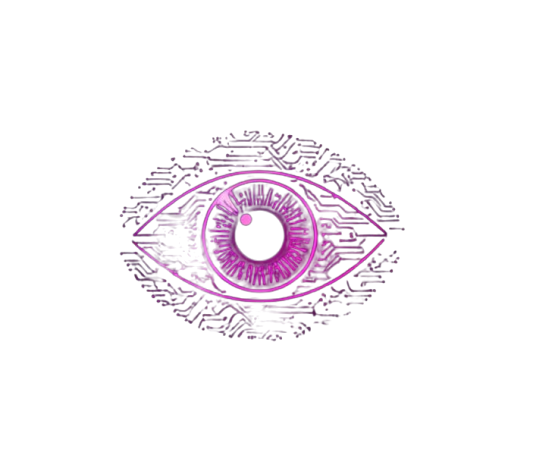

# FunAuth

<div align="center">
  

  <h1>FunAuth</h1>
  <p><strong>Visual cryptography for authentication, presented as a polished interactive web experience.</strong></p>
  <p>
    FunAuth turns cryptographic theory into something tangible: generate shares, reconstruct secrets,
    explore QR-based authentication, and compare scheme tradeoffs through a vivid cyber-inspired interface.
  </p>

  <p>
    <a href="#overview">Overview</a> ·
    <a href="#theory-in-brief">Theory</a> ·
    <a href="#quick-start">Quick Start</a> ·
    <a href="https://fun-auth-7zrd-bitexxlnb-laxita-jain-s-projects.vercel.app">Live Docs</a>
  </p>

  <p>
    
    
    
    
    
    
    
  </p>
</div>

## Overview

FunAuth is a visual cryptography playground and authentication demo built to make image-based secret sharing feel both rigorous and approachable. Instead of centering the experience around conventional passwords, it explores how secrets can be split into harmless-looking shares and reconstructed only when the correct pieces are combined.

The app includes guided flows for share generation, overlay-based recovery, QR authentication, comparative analysis, and embedded documentation. The result is part demo, part teaching tool, and part interface experiment.

## Why it stands out

- Demonstrates visual cryptography as an authentication mechanism rather than just a static academic concept.
- Brings together classical and computational schemes in one interface.
- Lets users compare security, reconstruction quality, memory usage, entropy, and pixel expansion tradeoffs.
- Ships with an in-app documentation experience so the theory and the implementation stay close together.

## Theory in brief

FunAuth is grounded in the core idea of **visual cryptography**: a secret image can be split into multiple shares such that each share alone reveals no useful information, while the correct combination reconstructs the original.

It highlights three underlying approaches:

- **Naor-Shamir (2,2)**: the classical 1994 visual cryptography scheme. A binary image is split into two shares using subpixel patterns. Each share looks like random noise, and the secret appears when the shares are overlaid. This provides information-theoretic secrecy, but introduces pixel expansion and contrast loss.
- **XOR-based visual cryptography**: one share is random noise and the other is derived with XOR against the secret. Reconstruction is exact and avoids pixel expansion, but it requires digital computation rather than physical stacking.
- **RGB channel splitting**: a color-oriented variant where channels are distributed across shares with added noise. This keeps full-color reconstruction possible while exposing the tradeoff between visibility and leakage.

In practical terms, FunAuth uses these schemes to show how a user-held share and a system-held share can participate in a challenge-response style authentication flow, particularly in the QR-based demo.

## What you can explore

- **Generate** visual cryptography shares from source imagery.
- **Overlay** existing shares to reconstruct the hidden secret.
- **Run** a QR authentication demo that models challenge generation and verification.
- **Compare** scheme behavior through analysis views covering timing, entropy, memory, and expansion.
- **Read** the embedded docs that explain the mathematics and security considerations in plain language.

## Documentation

The full documentation is available on the deployed site:

- Live docs: https://fun-auth-7zrd-bitexxlnb-laxita-jain-s-projects.vercel.app (head to the docs tab)
- Docs implementation: [src/pages/DocsPage.tsx](src/pages/DocsPage.tsx)
- Navigation entry: [src/components/CyberNav.tsx](src/components/CyberNav.tsx)

The deployed docs are the best place to read the theory and walkthrough in its intended presentation.

## Tech stack

- React 18
- TypeScript
- Vite
- Tailwind CSS
- shadcn/ui
- Framer Motion
- React Router
- TanStack Query
- Vitest

## Quick start

```bash
npm install
npm run dev
```

Open the app locally and visit:

- `/`
- `/generate`
- `/overlay`
- `/qr-auth`
- `/analysis`
- `/docs`

## Build and verify

```bash
npm run build
npm run lint
npm run test
```

## Project map

- App shell and routes: [src/App.tsx](src/App.tsx)
- Landing page: [src/pages/HomePage.tsx](src/pages/HomePage.tsx)
- Docs page: [src/pages/DocsPage.tsx](src/pages/DocsPage.tsx)
- Navigation: [src/components/CyberNav.tsx](src/components/CyberNav.tsx)
- Theme and core styling: [src/index.css](src/index.css)

## Notes

FunAuth is a single-page application, so the documentation is part of the product itself rather than a separate static site. That keeps the explanation, the demo flows, and the implementation aligned in one place.
